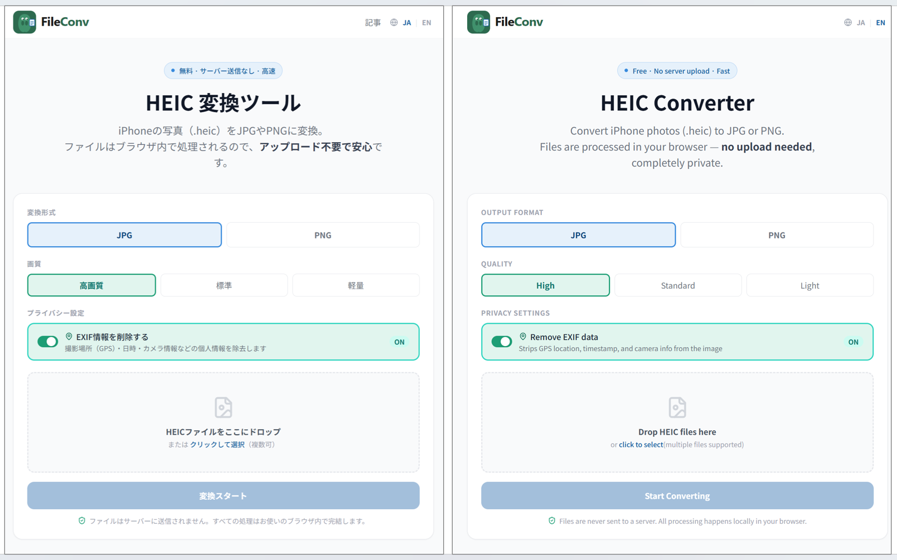
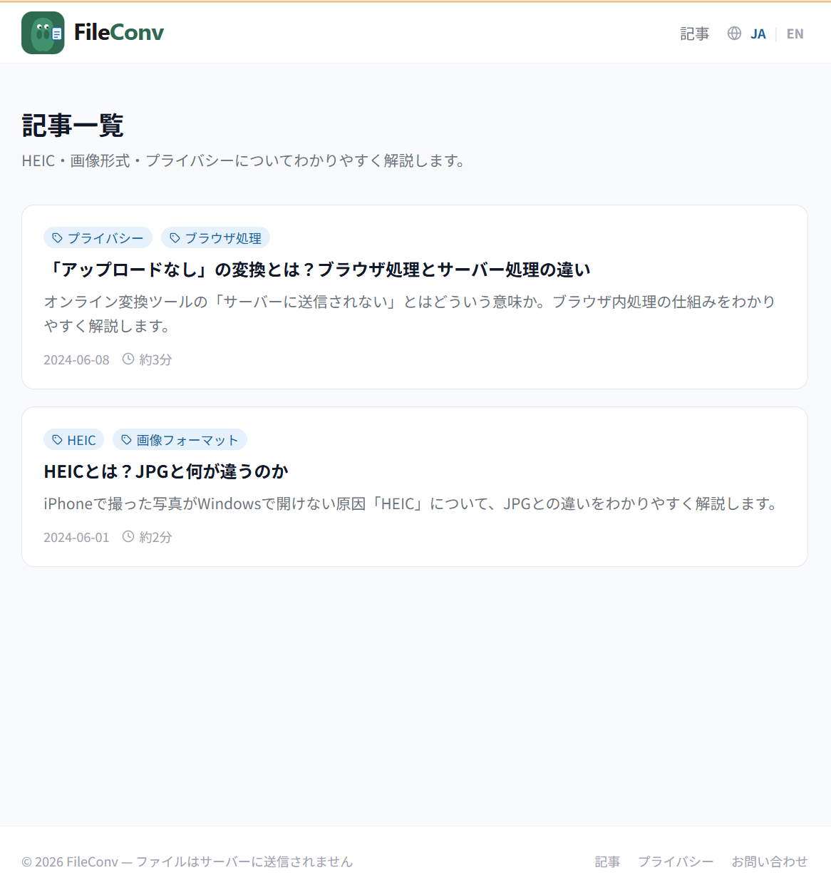

Free browser-based image converter. Convert HEIC, JPG, PNG, and WebP — entirely in your browser, with no file uploads.

**Live site:** [fileconv.app](https://fileconv.app)

## Why Browser-Only?

HEIC files often contain sensitive EXIF data — GPS coordinates, timestamps, and device info.  
Uploading them to a server creates unnecessary privacy risks and infrastructure costs.  
By processing everything client-side with WebAssembly-capable libraries, FileConv is:

- **Free to run** — no server, no storage costs
- **Private by design** — your photos never leave your device
- **Fast** — no upload/download round-trip

## Features

- **HEIC → JPG / PNG** — Convert iPhone photos to widely compatible formats
- **JPG → PNG / WebP** — Re-export with format or quality changes
- **PNG → JPG / WebP** — Compress or convert transparent images
- **WebP → JPG / PNG** — Convert modern format to universals
- **Quality selection** — High (0.95) / Standard (0.80) / Light (0.60) for JPG output
- **EXIF removal** — Strip GPS, timestamp, and camera metadata (default ON for HEIC→JPG)
- **Batch conversion** — Multiple files at once
- **Drag & drop** — Drop files directly onto the tool
- **Privacy first** — No uploads. All processing happens in the browser via Canvas API
- **Monetization** - Google AdSense + SEO blog

## Screenshots

| Converter Tool                                 | Blog                                      |
| ---------------------------------------------- | ----------------------------------------- |
|  |  |

## Tech Stack

|                 |                               |
| --------------- | ----------------------------- |
| Framework       | Next.js 14 (App Router)       |
| Language        | TypeScript                    |
| Styling         | Tailwind CSS                  |
| i18n            | next-intl v4 (JA / EN)        |
| HEIC conversion | heic2any                      |
| EXIF removal    | piexifjs                      |
| Blog            | next-mdx-remote + gray-matter |
| Hosting         | Vercel                        |

## Project Structure

```
src/
├── app/
│   ├── layout.tsx                    # Root layout (html/body, AdSense)
│   ├── sitemap.ts                    # Auto-generated sitemap
│   ├── robots.ts
│   ├── (ja)/                         # Japanese routes (no prefix)
│   │   ├── page.tsx                  # Home /
│   │   ├── blog/                     # /blog, /blog/[slug]
│   │   └── tools/converter/          # /tools/converter/[tool]
│   └── [locale]/                     # English routes (/en/...)
│       ├── page.tsx
│       ├── blog/                     # /en/blog, /en/blog/[slug]
│       └── tools/converter/
├── components/
│   ├── home/
│   │   └── HomePage.tsx              # Landing page with tool cards
│   ├── tool/
│   │   ├── ConverterPage.tsx         # Server component wrapping each tool page
│   │   ├── ConverterTool.tsx         # Client component — conversion logic
│   │   ├── HowItWorks.tsx
│   │   └── Faq.tsx
│   └── ui/
│       ├── Header.tsx
│       ├── Footer.tsx
│       ├── NavMenu.tsx               # Dropdown + mobile hamburger menu
│       └── LangSwitcher.tsx
└── lib/
    └── blog.ts                       # MDX loader with locale support

content/
├── blog/          # Japanese articles (*.mdx)
└── blog/en/       # English articles (*.mdx)

messages/
├── ja.json
└── en.json
```
